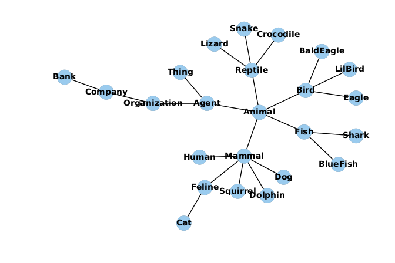
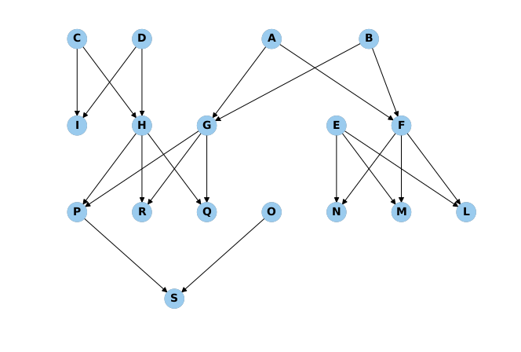

# Logic Tensor Networks Experiments

## Main Explanation

Logic Tensor Networks file are in the ltns folder and are taken from the original [source code](https://github.com/logictensornetworks/logictensornetworks)
Each experiment has its own folder and the experiment can be run independently.

In the relative folder you will find a `xx_run_reasoning.py` file that will allow you to run
multiple experiments over a set of hyper-parameters.

The code in `utils.evaluation_utilities.compute_all_values` gives you the possibility of computing performance metrix over the dataset (it is mainly a
wrapper around some sklearn functions)

## Gold Standard

Inside the *experiments* folder you will find the *gold_standard* folder that contains the transitive closure for 
the different KB used in this project: 
+ closed_tx contains the transitive closure for the taxonomy of experiment 1
+ closed_pa contains the KB of the parental relationships for experiment 2
+ closed_an contains the KB of the ancestor relationships for experiment 2

## Experiment 1: Taxonomy Reasoning

The KB is inspired to the [DBpedia Ontology](http://mappings.dbpedia.org/server/ontology/classes/)

## Experiment 2: Ancestor Reasoning

The KB is taken from an example that can be found in the following set of [slides](http://www.cs.cornell.edu/courses/cs4700/2011fa/lectures/16_FirstOrderLogic.pdf)

## Experiment 3: LTNs vs Multi-input Networks

In the multi-input folder you will find the `madnn.py` that can be used to run the multi-input network over the dataset. You can create random new datasets 
by decommenting some lines in the file. You can run the LTNs by calling the respective function defined in that file. This will generate two file with the predictions
that can be used within the `evaluate.py` script.

## Experiment 4: Time to Learn

Everything needed to generate the predicates and the contstants can be found in the performance folder. The script that gets the parameter can be modified to generatate predicates with 
arity that range from 1 to 3.

# Project Structure
<pre>
ltns-experiments
├── experiments
│   ├── ancestors
│   │   ├── ancestor_reasoning_extended.py
│   │   ├── ancestor_reasoning.py
│   │   ├── an_run_reasoning.py
│   │   ├── evaluate_ancestors.py
│   │   ├── __init__.py
│   │   ├── reasoning_results
│   │   │   ├── ...
│   │   │   └── ...
│   │   └── reasoning_results_over_extended_axioms
│   │       ├── ...
│   │       └── ...
│   ├── gold_standard
│   │   ├── closed_an
│   │   ├── closed_pa
│   │   └── closed_tx
│   ├── __init__.py
│   ├── multi-input
│   │   ├── an_prediction
│   │   ├── evaluate.py
│   │   ├── __init__.py
│   │   ├── madnn.py
│   │   ├── pa_prediction
│   │   └── training_testing
│   │       ├── test_an
│   │       ├── test_pa
│   │       ├── training_an
│   │       └── training_pa
│   ├── performance
│   │   ├── analyzer.py
│   │   ├── __init__.py
│   │   ├── performance_reasoning.py
│   │   ├── performance_results
│   │   │   ├── performance_1
│   │   │   ├── performance_2
│   │   │   └── performance_3
│   │   └── pf_run_reasoning.py
│   └── taxonomy
│       ├── evaluate_taxonomy.py
│       ├── __init__.py
│       ├── reasoning_results
│       │   ├── ...
│       │   └── ...
│       ├── taxonomy_reasoning.py
│       └── tx_run_reasoning.py
├── ltns
│   ├── __init__.py
│   ├── __init__.pyc
│   ├── logictensornetworks_library.py
│   ├── logictensornetworks.py
│   └── logictensornetworks_wrapper.py
├── README.md
└── utils
    ├── evaluation_utilities.py
    ├── evaluation_utilities.pyc
    └── __init__.py

</pre>
